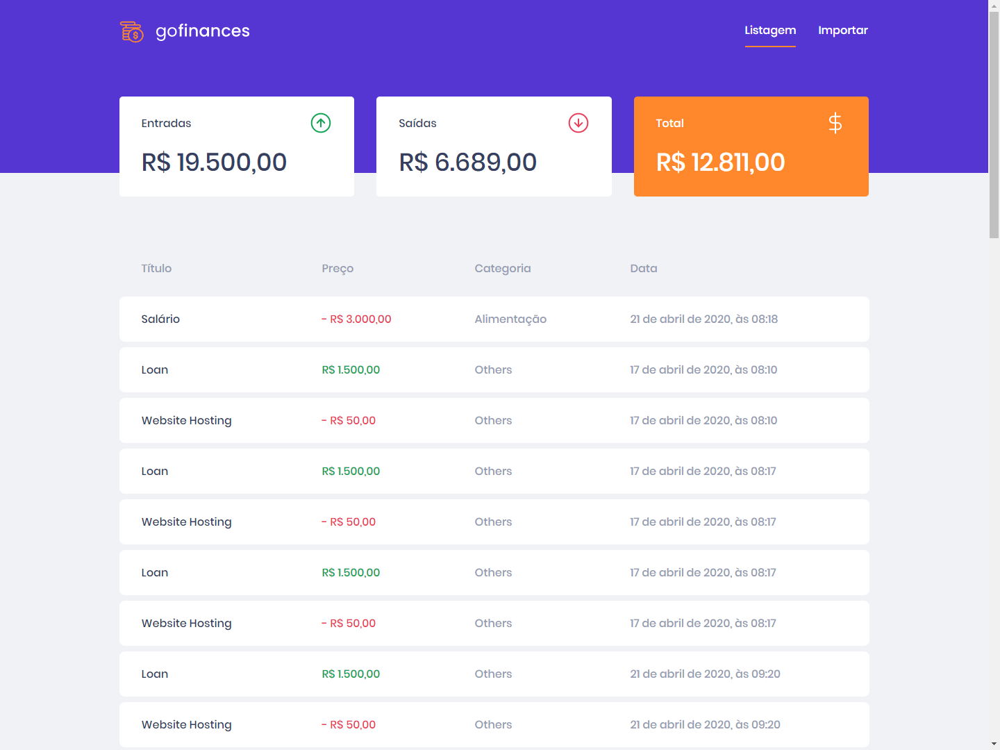
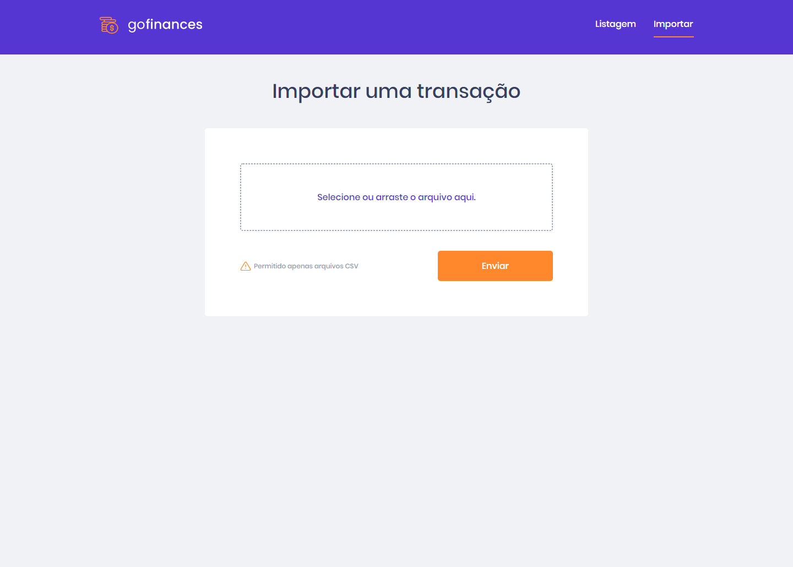

<h1 align="center">
 
Rocketseat - GoStack 11 - Challenge 06
</h1>

This project was created to solve a challenge requested by Rocketseat.
Gostack is immersive training in technologies, react and react natively.

  

  
  

## API

This project connects with API available in [here](https://github.com/rubensojunior/gostack11-desafio-05)

## Layout

This application has a layout that you can follow to be able to visualize its operation.

The layout can be accessed through the Figma page, at [here](https://www.figma.com/file/EgOhyj1Inz14dhWGVhRlhr/GoFinances?node-id=1%3A863).

## Features

- ⚛️ **React Js** — A JavaScript library for building user interfaces

- **`List your API repositories`**: Your `Dashboard` page should be able to display a listing through a table, with the `title`, `value`, `type` and `category` field of all transactions that are registered in your API.

- **`Display the balance of your API`**: On your `Dashboard` page, you must display the balance that is returned from your backend, containing the grand total, together with the total of entries and exits.

- **`Import CSV` files**: On your `Import` page, you must allow sending a file in `csv` format to your backend, which will import transactions into your database. The csv file must follow the following [template](https://github.com/Rocketseat/bootcamp-gostack-desafios/blob/master/desafio-database-upload/assets/file.csv).

### Tests

- **`should be able to list the total balance inside the cards`**

* **`should be able to list the transactions`**

- **`should be able to navigate to the import page`**

- **`should be able to upload a file`**

## Getting started

- Clone project > enter the project folder
- run `yarn`
- run `yarn start`

## License

This project is licensed under the MIT License - see the [LICENSE](https://opensource.org/licenses/MIT) page for details.

---

Created with passion by me 👨🏻‍💻
